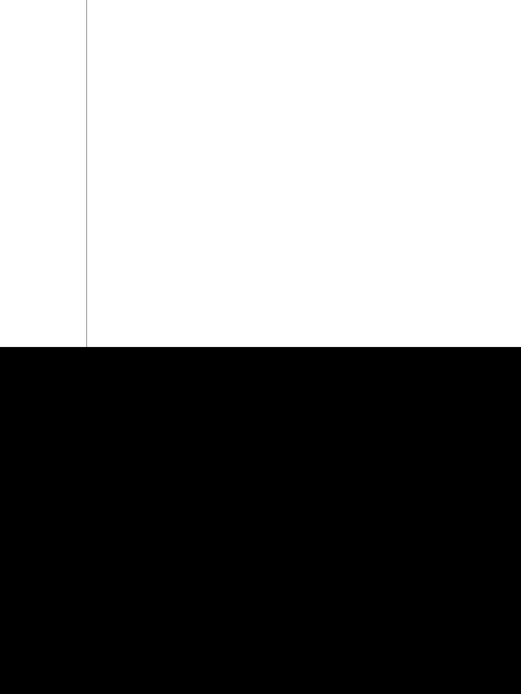
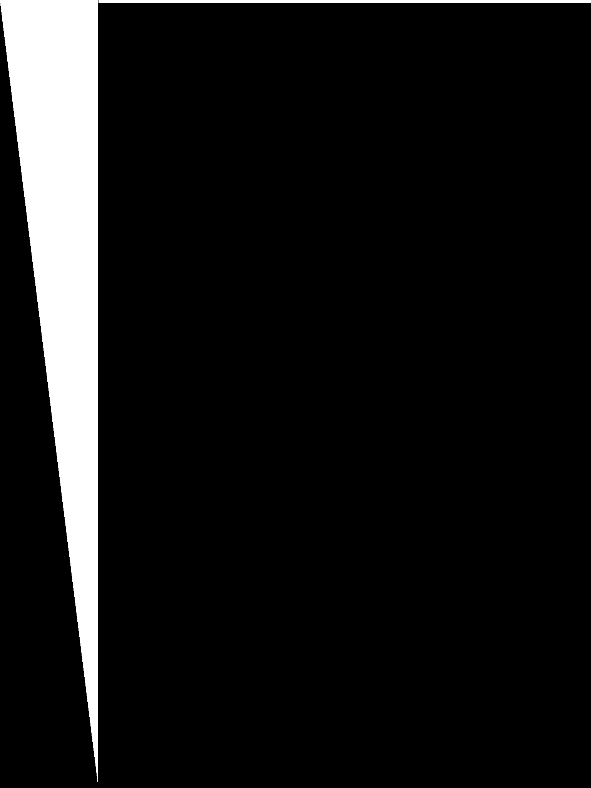

GPUPrecisionRounding
====================

This is a simple app that shows the difference in rounding behavior between Apple A7 GPUs and earlier generations when writing fragment shader output into texture memory.

The central fragment shader is fract.frag. It is passed in a ramp texture (ramp255.png) that has the 256 distinct greyscale values in the first 256 columns.
The shader is run twice. The first time (u_Threshold = 0), it samples the ramp texture and adds along each column a value between 0.0 (bottom) and 1.0/255.0 (top).

The output is stored in a 8-bit RGBA buffer. 

The second time the shader is run (u_Threshold = 1), it outputs a black fragment if the difference between the fragment value in the buffer and the sampled ramp texture is smaller than 0.5/255.0 (i.e. perfect rounding would round them to the same value), and white otherwise.

With exact rounding, this means that the second output of the fragment shader should produce an image that switches from black to white halfway across the screen. That is indeed the case for iPad generations without A7 GPUs:

(Column 255 is completely black because the ramp texture is already saturated, and adding a value to it doesn't change the final pixel value).

On A7 GPUs however, we see a very different pattern:

The GPU essentially seems to do a `floor(x * 256.0)` instead of the correct `round(x * 255.0)`. This is likely quicker to evaluate as it can be implemented as simple bit truncation.

This is consistent with OpenGL ES 3 specs, which have been changed to be more lenient about rounding:

[OpenGL ES 3.1 Specification: 2.3.4.2 Conversion from Floating-Point to Normalized Fixed-Point](http://www.khronos.org/registry/gles/specs/3.1/es_spec_3.1.pdf):

    The conversion from a floating-point value f to the corresponding 
    unsigned normalized fixed-point value c is defined by first clamping 
    f to the range [0, 1], then computing 
    
        f′ =convert_float_uint(f*(2b−1), b) (2.3)

    where convert_float_uint(r,b) returns one of the two unsigned binary 
    integer values with exactly b bits which are closest to the floating-point 
    value r (where rounding to nearest is preferred).

To restore correct rounding, we can implement the multiplication by 255.0 in the shader, and offset by 0.5:

    color = (color * 255.0 + 0.5) / 256.0;

This way the GPU's bit truncation will result in the correct rounding behavior.

# Thanks
[Ray Wenderlich's](http://www.raywenderlich.com/3664/opengl-tutorial-for-ios-opengl-es-2-0) OpenGL tutorial was a nice quick way to get up and running for this app. Thanks!

Many thanks to [Ben Weiss](http://www.fract.al/) for helping me make sense of this rounding behavior and restoring my sanity. :)
